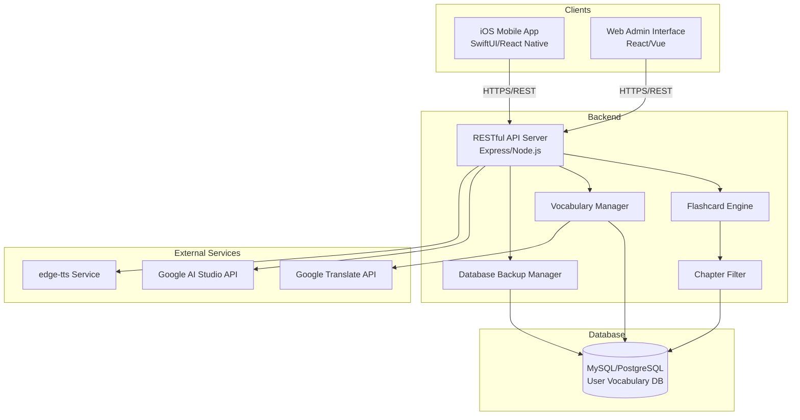
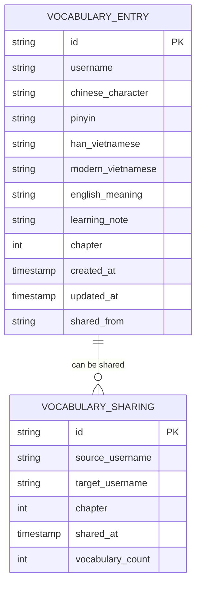

# Design Document: Chinese Learning App

## Overview

The Chinese Learning App is a dual-platform application consisting of a native iOS mobile app for learning features and a web-based admin interface for vocabulary management. The system supports multiple interface languages (English, Vietnamese) and integrates with external services for translation, AI content generation, and text-to-speech functionality.

### Key Features

**iOS Mobile App (Learning Features):**
- Three flashcard modes: Chinese→Meanings, English→Chinese, Vietnamese→Chinese
- AI-generated reading comprehension texts using user's vocabulary
- Chapter-based vocabulary filtering for focused learning
- Text-to-speech pronunciation using edge-tts
- Native iOS UI with SwiftUI or React Native

**Web Admin Interface (Management Features):**
- Vocabulary management with full editing capabilities
- Manual translation preview before saving
- Vocabulary sharing between users by chapter
- Automatic translation for vocabulary entries
- Password-protected database backup and restore
- Responsive web design for desktop and mobile browsers

**Shared Backend:**
- RESTful API serving both iOS app and web admin
- User-isolated vocabulary databases without authentication
- Integration with Google Translate, Google AI Studio, and edge-tts

### Design Goals

- Provide a native mobile experience for learning on iPhone
- Enable efficient vocabulary management through web interface
- Support multiple learning modalities (recognition, recall, comprehension)
- Minimize manual data entry through automatic translation
- Foster collaborative learning through vocabulary sharing

## Architecture

### System Architecture

The application follows a client-server architecture with two distinct client applications (iOS mobile app and web admin) consuming a shared backend API:



### Component Responsibilities

**iOS Mobile App (Learning Client):**
- Native iOS interface for flashcard practice
- Text comprehension exercises with interactive characters
- Audio playback for TTS pronunciation
- Chapter range selection for focused learning
- Offline-capable with local caching (optional)

**Web Admin Interface (Management Client):**
- Vocabulary CRUD operations (create, read, update, delete)
- Translation preview and automatic translation
- Vocabulary sharing between users
- Database backup and restore operations
- Responsive design for desktop and mobile browsers

**Backend API Layer:**
- RESTful API endpoints for all operations
- Flashcard logic and vocabulary selection
- Chapter-based filtering
- Vocabulary CRUD operations
- Integration with external services
- User isolation enforcement

**Data Layer:**
- User-isolated vocabulary storage
- Chapter-based vocabulary organization
- Vocabulary sharing metadata
- Database backup/restore functionality

**External Services:**
- Google Translate: Automatic translation for missing fields
- Google AI Studio: Context-aware text generation
- edge-tts: Chinese pronunciation synthesis

### Technology Stack

**iOS Mobile App:**
- **Option A (Recommended)**: SwiftUI + Swift for native iOS experience
- **Option B**: React Native for cross-platform potential
- URLSession or Alamofire for API communication
- AVFoundation for audio playback
- Local storage with CoreData or UserDefaults

**Web Admin Interface:**
- React or Vue.js for responsive web UI
- Axios for API communication
- Modern CSS framework (Tailwind, Material-UI)
- Form validation and state management

**Backend:**
- Node.js with Express.js
- TypeScript for type safety
- MySQL or PostgreSQL database
- JWT or session-based authentication (optional)

**External APIs:**
- Google Translate API client library
- Google AI Studio API client library
- edge-tts Python library or equivalent

## Components and Interfaces

### Core Components

#### 1. Flashcard Engine

**Purpose:** Manages flashcard presentation logic and vocabulary selection

**Responsibilities:**
- Select random vocabulary from filtered chapter range
- Present appropriate fields based on flashcard mode
- Track current flashcard state (question/answer)

**Interface:**
```typescript
interface FlashcardEngine {
  // Get next flashcard for specified mode and chapter range
  getNextCard(username: string, mode: FlashcardMode, chapterRange: ChapterRange): Flashcard
  
  // Reveal answer for current flashcard
  revealAnswer(flashcardId: string): FlashcardAnswer
}

enum FlashcardMode {
  ChineseToMeanings,
  EnglishToChinese,
  VietnameseToChinese
}

interface ChapterRange {
  start: number
  end: number
}

interface Flashcard {
  id: string
  mode: FlashcardMode
  question: FlashcardQuestion
}

interface FlashcardQuestion {
  displayText: string
  fieldType: 'chinese' | 'english' | 'vietnamese'
}

interface FlashcardAnswer {
  chinese?: string
  pinyin?: string
  hanVietnamese?: string
  modernVietnamese?: string
  englishMeaning?: string
  learningNote?: string
}
```

#### 2. Vocabulary Manager

**Purpose:** Handles vocabulary CRUD operations, editing, and sharing

**Responsibilities:**
- Create, read, update, delete vocabulary entries
- Edit all fields of existing vocabulary entries
- Manual translation on-demand (preview before save)
- Automatic translation for missing fields on save
- Vocabulary sharing between users
- User isolation enforcement

**Interface:**
```typescript
interface VocabularyManager {
  // Create new vocabulary entry
  createEntry(username: string, entry: VocabularyInput): Promise<VocabularyEntry>
  
  // Update existing vocabulary entry
  updateEntry(username: string, entryId: string, updates: Partial<VocabularyInput>): Promise<VocabularyEntry>
  
  // Delete vocabulary entry
  deleteEntry(username: string, entryId: string): Promise<void>
  
  // Get vocabulary entries for user and chapter range
  getEntries(username: string, chapterRange?: ChapterRange): Promise<VocabularyEntry[]>
  
  // Get single vocabulary entry by ID
  getEntry(username: string, entryId: string): Promise<VocabularyEntry>
  
  // Generate translations without saving (for preview)
  previewTranslations(chineseCharacter: string): Promise<TranslationPreview>
  
  // Share chapter vocabulary from one user to another
  shareChapter(sourceUsername: string, targetUsername: string, chapter: number): Promise<void>
  
  // Get available chapters for a user
  getAvailableChapters(username: string): Promise<number[]>
  
  // Get users who have shared vocabulary for a chapter
  getSharedVocabularySources(chapter: number): Promise<string[]>
}

interface VocabularyInput {
  chineseCharacter: string
  pinyin?: string
  hanVietnamese?: string
  modernVietnamese?: string
  englishMeaning?: string
  learningNote?: string
  chapter: number
}

interface VocabularyEntry extends VocabularyInput {
  id: string
  username: string
  createdAt: Date
  updatedAt: Date
}

interface TranslationPreview {
  modernVietnamese: string
  englishMeaning: string
}
```

#### 3. Translation Service

**Purpose:** Integrates with Google Translate API for automatic translations

**Responsibilities:**
- Translate Chinese to Vietnamese
- Translate Chinese to English
- Handle API errors gracefully

**Interface:**
```typescript
interface TranslationService {
  // Translate Chinese to Vietnamese
  translateToVietnamese(chineseText: string): Promise<string>
  
  // Translate Chinese to English
  translateToEnglish(chineseText: string): Promise<string>
  
  // Batch translate multiple texts
  batchTranslate(texts: string[], targetLanguage: 'vi' | 'en'): Promise<string[]>
}
```

#### 4. AI Text Generator

**Purpose:** Generates reading comprehension texts using user's vocabulary

**Responsibilities:**
- Generate contextual Chinese text using specified characters
- Limit text to 40 words maximum
- Accept up to 300 random characters from chapter range

**Interface:**
```typescript
interface AITextGenerator {
  // Generate reading comprehension text
  generateText(characters: string[], maxWords: number): Promise<GeneratedText>
}

interface GeneratedText {
  chineseText: string
  pinyin: string
  wordCount: number
}
```

#### 5. TTS Service

**Purpose:** Provides text-to-speech pronunciation using edge-tts

**Responsibilities:**
- Generate audio for Chinese characters
- Return audio stream or URL
- Handle edge-tts voice selection

**Interface:**
```typescript
interface TTSService {
  // Generate pronunciation audio for Chinese text
  pronounce(chineseText: string): Promise<AudioData>
}

interface AudioData {
  audioUrl: string
  format: 'mp3' | 'wav'
  duration: number
}
```

#### 6. Chapter Filter

**Purpose:** Filters vocabulary based on user-selected chapter range

**Responsibilities:**
- Validate chapter range
- Query vocabulary within range
- Provide random sampling for AI text generation

**Interface:**
```typescript
interface ChapterFilter {
  // Get vocabulary IDs within chapter range
  getVocabularyInRange(username: string, range: ChapterRange): Promise<string[]>
  
  // Get random sample of characters from chapter range
  getRandomCharacters(username: string, range: ChapterRange, count: number): Promise<string[]>
  
  // Validate chapter range
  validateRange(username: string, range: ChapterRange): Promise<boolean>
}
```

#### 7. Database Backup Manager

**Purpose:** Handles database backup and restore operations with password protection

**Responsibilities:**
- Authenticate admin access with password
- Export complete database to backup file
- Import and restore database from backup file
- Validate backup file format
- Ensure data integrity during operations

**Interface:**
```typescript
interface DatabaseBackupManager {
  // Authenticate admin access
  authenticate(password: string): boolean
  
  // Export entire database to backup file
  exportDatabase(): Promise<BackupFile>
  
  // Import and restore database from backup file
  importDatabase(backupFile: BackupFile): Promise<RestoreResult>
  
  // Validate backup file format
  validateBackupFile(backupFile: BackupFile): Promise<ValidationResult>
}

interface BackupFile {
  version: string
  exportedAt: Date
  vocabularyEntries: VocabularyEntry[]
  checksum: string
}

interface RestoreResult {
  success: boolean
  entriesRestored: number
  errors?: string[]
}

interface ValidationResult {
  valid: boolean
  errors?: string[]
}
```

### API Endpoints

**Flashcard Endpoints:**
- `GET /api/{username}/flashcard/next?mode={mode}&chapterStart={start}&chapterEnd={end}` - Get next flashcard
- `GET /api/{username}/flashcard/{id}/answer` - Reveal flashcard answer

**Vocabulary Endpoints:**
- `POST /api/{username}/vocabulary` - Create vocabulary entry
- `GET /api/{username}/vocabulary?chapterStart={start}&chapterEnd={end}` - Get vocabulary entries
- `GET /api/{username}/vocabulary/{id}` - Get single vocabulary entry
- `PUT /api/{username}/vocabulary/{id}` - Update vocabulary entry
- `DELETE /api/{username}/vocabulary/{id}` - Delete vocabulary entry
- `POST /api/{username}/vocabulary/translate` - Preview translations for Chinese character
- `GET /api/{username}/vocabulary/chapters` - Get available chapters
- `POST /api/{username}/vocabulary/share` - Share chapter vocabulary with another user
- `GET /api/vocabulary/shared?chapter={chapter}` - Get users who shared vocabulary for chapter

**Text Comprehension Endpoints:**
- `GET /api/{username}/comprehension/generate?chapterStart={start}&chapterEnd={end}` - Generate reading text
- `GET /api/{username}/comprehension/character-info?character={char}` - Get character details

**TTS Endpoints:**
- `GET /api/tts/pronounce?text={chineseText}` - Get pronunciation audio

**Admin Endpoints:**
- `GET /api/{username}/admin/vocabulary` - List all vocabulary for management
- `PUT /api/{username}/admin/vocabulary/{id}` - Update vocabulary entry
- `DELETE /api/{username}/admin/vocabulary/{id}` - Delete vocabulary entry

**Database Management Endpoints:**
- `POST /api/admin/authenticate` - Authenticate with password
- `GET /api/admin/backup` - Export database backup (requires authentication)
- `POST /api/admin/restore` - Import and restore database (requires authentication)

## Data Models

### Vocabulary Entry

```typescript
interface VocabularyEntry {
  id: string                    // Unique identifier
  username: string              // Owner username
  chineseCharacter: string      // Chinese written form
  pinyin: string                // Romanized pronunciation
  hanVietnamese: string         // Vietnamese "tiếng Hán" meaning
  modernVietnamese: string      // Contemporary Vietnamese meaning
  englishMeaning: string        // English translation
  learningNote: string          // User notes
  chapter: number               // Chapter number
  createdAt: Date              // Creation timestamp
  updatedAt: Date              // Last update timestamp
  sharedFrom?: string          // Original username if shared
}
```

**Database Schema:**
```sql
CREATE TABLE vocabulary_entries (
  id VARCHAR(36) PRIMARY KEY,
  username VARCHAR(255) NOT NULL,
  chinese_character VARCHAR(10) NOT NULL,
  pinyin VARCHAR(255) NOT NULL,
  han_vietnamese TEXT,
  modern_vietnamese TEXT,
  english_meaning TEXT,
  learning_note TEXT,
  chapter INTEGER NOT NULL,
  created_at TIMESTAMP DEFAULT CURRENT_TIMESTAMP,
  updated_at TIMESTAMP DEFAULT CURRENT_TIMESTAMP ON UPDATE CURRENT_TIMESTAMP,
  shared_from VARCHAR(255),
  INDEX idx_username_chapter (username, chapter),
  INDEX idx_chapter (chapter)
);
```

### User Session

```typescript
interface UserSession {
  username: string
  currentChapterRange: ChapterRange
  lastActivity: Date
}
```

**Storage:** In-memory session store or browser localStorage

### Flashcard State

```typescript
interface FlashcardState {
  currentCard: Flashcard
  mode: FlashcardMode
  chapterRange: ChapterRange
  revealed: boolean
}
```

**Storage:** Client-side state management

### Generated Text Cache

```typescript
interface GeneratedTextCache {
  id: string
  username: string
  chapterRange: ChapterRange
  text: GeneratedText
  characterDetails: Map<string, VocabularyEntry>
  generatedAt: Date
  expiresAt: Date
}
```

**Storage:** Server-side cache (Redis or in-memory) with TTL

### Vocabulary Sharing Record

```typescript
interface VocabularySharingRecord {
  id: string
  sourceUsername: string
  targetUsername: string
  chapter: number
  sharedAt: Date
  vocabularyCount: number
}
```

**Database Schema:**
```sql
CREATE TABLE vocabulary_sharing (
  id VARCHAR(36) PRIMARY KEY,
  source_username VARCHAR(255) NOT NULL,
  target_username VARCHAR(255) NOT NULL,
  chapter INTEGER NOT NULL,
  shared_at TIMESTAMP DEFAULT CURRENT_TIMESTAMP,
  vocabulary_count INTEGER NOT NULL,
  UNIQUE KEY unique_share (source_username, target_username, chapter),
  INDEX idx_target_chapter (target_username, chapter)
);
```

### Data Relationships



### Data Constraints

- `chineseCharacter`: Required, 1-10 characters
- `username`: Required, alphanumeric with hyphens/underscores
- `chapter`: Required, positive integer
- `pinyin`: Auto-generated if not provided (via external service or library)
- `modernVietnamese`: Auto-translated if not provided
- `englishMeaning`: Auto-translated if not provided
- `hanVietnamese`: Optional, no auto-generation
- `learningNote`: Optional, user-provided only

