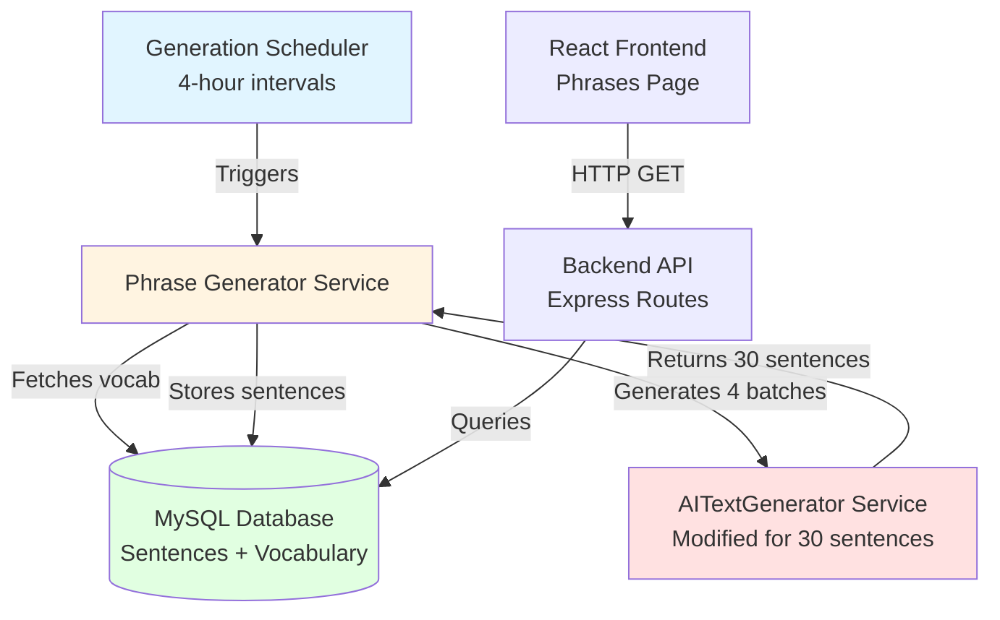

# Design Document: Pre-Generated Phrases Feature

## Overview

The pre-generated phrases feature automates the creation of Chinese practice sentences for vocabulary groups using the Google Gemini API. The system operates on a 4-hour generation cycle, creating 120 sentences per vocabulary group (5 groups total, representing the 5 most recent chapters with cumulative vocabulary from chapter 1). Each generation batch randomly selects 300 characters and generates 30 sentences, ensuring diverse practice content.

The feature integrates with the existing AITextGenerator service, modifying it to return 30 sentences per API call instead of a single sentence. Generated sentences are stored in a MySQL database with associated metadata (pinyin, used characters, timestamps) and presented to users through a new Phrases page with interactive character details matching the existing AI test page format.

Key architectural components:
- Database schema for sentence storage
- Scheduler service for automated 4-hour generation cycles
- Phrase generator service with batch processing logic
- Backend API endpoints for sentence retrieval
- Frontend Phrases page with interactive UI

## Architecture

### System Components



### Data Flow

1. **Generation Cycle**: Scheduler triggers every 4 hours → Phrase Generator processes all 5 vocab groups
2. **Batch Processing**: For each vocab group, generate 4 batches (300 chars × 30 sentences each)
3. **Storage**: Delete existing sentences for vocab group → Store new 120 sentences
4. **Retrieval**: Frontend requests sentences by vocab group → API returns sentences with metadata
5. **Display**: User clicks sentence → Character details fetched and displayed

### Technology Stack

- **Backend**: Node.js/TypeScript, Express (port 3000)
- **Frontend**: React/TypeScript, Vite (port 5173)
- **Database**: MySQL with utf8mb4 encoding
- **AI Service**: Google Gemini API (gemini-flash-lite-latest model)
- **Scheduler**: node-cron for interval-based execution
- **Pinyin**: pinyin npm package for romanization

## Components and Interfaces

### Database Schema

#### Sentences Table

```sql
CREATE TABLE IF NOT EXISTS pre_generated_sentences (
  id VARCHAR(36) PRIMARY KEY,
  vocab_group_id INT NOT NULL,
  chinese_text TEXT NOT NULL,
  pinyin TEXT NOT NULL,
  used_characters JSON NOT NULL,
  generation_timestamp TIMESTAMP DEFAULT CURRENT_TIMESTAMP,
  INDEX idx_vocab_group (vocab_group_id)
) ENGINE=InnoDB DEFAULT CHARSET=utf8mb4 COLLATE=utf8mb4_unicode_ci;
```

**Fields**:
- `id`: UUID primary key
- `vocab_group_id`: Integer 1-5 representing vocab group (chapter endpoint)
- `chinese_text`: Generated Chinese sentence
- `pinyin`: Romanized pronunciation
- `used_characters`: JSON array of characters used in sentence
- `generation_timestamp`: When sentence was generated

**Indexes**: `idx_vocab_group` for efficient retrieval by vocab group

### Backend Services

#### PhraseGeneratorService

**Location**: `packages/backend/src/services/PhraseGeneratorService.ts`

**Responsibilities**:
- Define 5 vocab groups based on most recent chapters
- Orchestrate batch generation for all vocab groups
- Coordinate with AITextGenerator for sentence generation
- Manage database operations (delete old, insert new)

**Interface**:
```typescript
interface VocabGroup {
  id: number;
  chapterEndpoint: number;
  chapterStart: number; // Always 1
}

interface GeneratedSentence {
  id: string;
  vocabGroupId: number;
  chineseText: string;
  pinyin: string;
  usedCharacters: string[];
  generationTimestamp: Date;
}

class PhraseGeneratorService {
  // Get 5 most recent chapters from database
  async getVocabGroups(): Promise<VocabGroup[]>;
  
  // Generate all sentences for all vocab groups
  async generateAllSentences(): Promise<void>;
  
  // Generate 120 sentences for one vocab group (4 batches × 30)
  async generateSentencesForGroup(group: VocabGroup): Promise<GeneratedSentence[]>;
  
  // Generate one batch of 30 sentences
  async generateBatch(characters: string[]): Promise<GeneratedSentence[]>;
  
  // Delete existing sentences for vocab group
  async deleteSentencesForGroup(vocabGroupId: number): Promise<void>;
  
  // Store sentences in database
  async storeSentences(sentences: GeneratedSentence[]): Promise<void>;
}
```

#### GenerationScheduler

**Location**: `packages/backend/src/services/GenerationScheduler.ts`

**Responsibilities**:
- Schedule automated generation every 4 hours
- Trigger PhraseGeneratorService
- Log generation status and errors

**Interface**:
```typescript
class GenerationScheduler {
  private cronJob: CronJob | null;
  
  // Start the 4-hour scheduler
  start(): void;
  
  // Stop the scheduler
  stop(): void;
  
  // Manually trigger generation (for testing)
  async triggerGeneration(): Promise<void>;
}
```

**Cron Expression**: `0 */4 * * *` (every 4 hours at minute 0)

#### Modified AITextGenerator

**Location**: `packages/backend/src/services/AITextGenerator.ts`

**Modifications**:
- Add new method `generateMultipleSentences(characters: string[], count: number = 30)`
- Modify prompt to request multiple sentences
- Parse response to extract array of sentences with metadata
- Maintain backward compatibility with existing `generateText()` method

**New Interface**:
```typescript
interface GeneratedSentence {
  chineseText: string;
  pinyin: string;
  usedCharacters: string[];
}

class AITextGenerator {
  // Existing method (unchanged)
  async generateText(characters: string[], maxWords: number): Promise<GeneratedText>;
  
  // New method for batch generation
  async generateMultipleSentences(
    characters: string[], 
    count: number = 30
  ): Promise<GeneratedSentence[]>;
}
```

### Backend API Routes

**Location**: `packages/backend/src/routes/phrases.routes.ts`

**Endpoints**:

```typescript
// GET /api/phrases/vocab-groups
// Returns list of 5 vocab groups with chapter ranges
interface VocabGroupResponse {
  id: number;
  chapterStart: number;
  chapterEnd: number;
  sentenceCount: number;
}

// GET /api/phrases/sentences/:vocabGroupId
// Returns all 120 sentences for a vocab group
interface SentenceResponse {
  id: string;
  vocabGroupId: number;
  chineseText: string;
  pinyin: string;
  usedCharacters: string[];
  generationTimestamp: string;
}

// POST /api/phrases/generate
// Manually trigger generation (admin only)
// Returns: { success: boolean, message: string }

// GET /api/phrases/character-info/:character
// Returns character details from vocabulary database
interface CharacterInfoResponse {
  chineseCharacter: string;
  pinyin: string;
  hanVietnamese?: string;
  modernVietnamese?: string;
  englishMeaning?: string;
}
```

### Frontend Components

#### PhrasesPage Component

**Location**: `packages/frontend/src/pages/PhrasesPage.tsx`

**Responsibilities**:
- Display 5 vocab groups with chapter ranges
- Show 120 sentences per group
- Handle sentence click to show character details
- Fetch and display character information

**State Management**:
```typescript
interface PhrasesPageState {
  vocabGroups: VocabGroupResponse[];
  sentences: Map<number, SentenceResponse[]>;
  selectedSentence: SentenceResponse | null;
  characterDetails: CharacterInfo[];
  loading: boolean;
  error: string | null;
}
```

**UI Layout**:
- Accordion/tabs for each vocab group
- Grid layout for sentences (clickable cards)
- Modal/expandable section for character details
- Character details table matching AITestPage format

## Data Models

### VocabGroup Model

```typescript
interface VocabGroup {
  id: number;              // 1-5
  chapterStart: number;    // Always 1
  chapterEndpoint: number; // One of 5 most recent chapters
}
```

**Determination Logic**:
1. Query database for all unique chapters: `SELECT DISTINCT chapter FROM vocabulary_entries ORDER BY chapter DESC`
2. Take top 5 chapters
3. Create vocab groups: `{ id: 1, chapterStart: 1, chapterEndpoint: chapters[0] }`, etc.

### Sentence Model

```typescript
interface Sentence {
  id: string;
  vocabGroupId: number;
  chineseText: string;
  pinyin: string;
  usedCharacters: string[];
  generationTimestamp: Date;
}
```

### CharacterInfo Model

```typescript
interface CharacterInfo {
  chineseCharacter: string;
  pinyin: string;
  hanVietnamese?: string;
  modernVietnamese?: string;
  englishMeaning?: string;
}
```

**Source**: Existing `vocabulary_entries` table


## Correctness Properties

A property is a characteristic or behavior that should hold true across all valid executions of a system—essentially, a formal statement about what the system should do. Properties serve as the bridge between human-readable specifications and machine-verifiable correctness guarantees.

### Property 1: Vocab Group Uniqueness

For any set of vocab groups generated by the system, each vocab group must have a unique chapter endpoint, and all chapter endpoints must come from the 5 most recent chapters in the vocabulary database.

**Validates: Requirements 1.2**

### Property 2: Cumulative Vocabulary Inclusion

For any vocab group with chapter endpoint N, the vocabulary set must include all vocabulary entries from chapter 1 through chapter N (inclusive).

**Validates: Requirements 1.3**

### Property 3: Vocab Group Ordering

For any list of vocab groups returned by the system, the groups must be ordered by chapter endpoint in ascending order.

**Validates: Requirements 1.4**

### Property 4: Scheduler Interval Consistency

For any time window, the generation scheduler must trigger sentence generation at 4-hour intervals (0, 4, 8, 12, 16, 20 hours).

**Validates: Requirements 2.1**

### Property 5: Complete Group Processing

For any generation trigger, sentences must be generated for all 5 vocab groups without exception.

**Validates: Requirements 2.2**

### Property 6: Sentence Replacement

For any vocab group, when new sentences are generated, all existing sentences for that vocab group must be deleted before new sentences are stored, ensuring no old sentences remain.

**Validates: Requirements 2.4, 4.6**

### Property 7: Batch Character Selection

For any generation batch, exactly 300 characters must be randomly selected from the vocab group's vocabulary, and these characters must be passed to the AITextGenerator service.

**Validates: Requirements 3.2, 3.5**

### Property 8: Batch Sentence Count

For any generation batch, exactly 30 sentences must be generated using the selected 300 characters.

**Validates: Requirements 3.3**

### Property 9: AITextGenerator Integration

For any sentence generation request, the Phrase Generator must invoke the AITextGenerator service and receive 30 sentences per API call.

**Validates: Requirements 3.4, 8.1, 8.2**

### Property 10: Total Sentence Count Per Group

For any vocab group, after generation completes, exactly 120 sentences must be stored in the database (4 batches × 30 sentences).

**Validates: Requirements 3.6**

### Property 11: Complete Sentence Persistence

For any generated sentence, all required fields (Chinese text, vocab group ID, pinyin, used characters, generation timestamp) must be stored in the database and retrievable.

**Validates: Requirements 4.1, 4.2, 4.3, 4.4, 4.5**

### Property 12: Complete Data Extraction

For any AITextGenerator response, all required fields (chineseText, pinyin, usedCharacters) must be extracted and stored in the sentence entry.

**Validates: Requirements 8.3, 8.4, 8.5, 8.6**

### Property 13: Sentence Display Completeness

For any vocab group displayed on the Phrases page, all 120 sentences must be rendered in Chinese text and be clickable.

**Validates: Requirements 5.4, 5.5, 5.6**

### Property 14: Character Detail View Interaction

For any sentence clicked on the Phrases page, the character detail view must display the sentence's pinyin and a list of all characters used in the sentence.

**Validates: Requirements 6.1, 6.2, 6.3**

### Property 15: Character Information Completeness

For any character displayed in the character detail view, all available fields (Chinese character, pinyin, Han Vietnamese, Modern Vietnamese, English meaning) from the vocabulary database must be displayed.

**Validates: Requirements 6.5**

## Error Handling

### Generation Errors

**AI API Failures**:
- Retry logic: 3 attempts with exponential backoff (1s, 2s, 4s)
- Fallback: Log error, skip batch, continue with next batch
- Alert: Send notification if entire generation cycle fails

**Database Errors**:
- Transaction rollback: If sentence storage fails, rollback deletion
- Retry logic: 2 attempts for transient errors
- Alert: Log critical errors for manual intervention

**Validation Errors**:
- Character count mismatch: Log warning, use available characters
- Missing fields: Use default values (empty string for optional fields)
- Invalid data: Skip sentence, log error, continue processing

### Scheduler Errors

**Missed Executions**:
- Catch-up logic: If scheduler misses execution, trigger immediately on next check
- Monitoring: Log all scheduled executions and actual executions
- Alert: Notify if scheduler fails to execute for 8+ hours

**Concurrent Executions**:
- Mutex lock: Prevent multiple generation cycles from running simultaneously
- Timeout: Kill generation if it exceeds 30 minutes
- Recovery: Release lock on timeout or error

### API Errors

**Request Validation**:
- Invalid vocab group ID: Return 400 Bad Request with error message
- Missing parameters: Return 400 Bad Request with required parameters
- Database unavailable: Return 503 Service Unavailable

**Response Handling**:
- Empty results: Return empty array with 200 OK
- Partial data: Return available data with warning header
- Timeout: Return 504 Gateway Timeout after 30 seconds

### Frontend Errors

**Network Failures**:
- Retry logic: 2 automatic retries with 1-second delay
- User feedback: Display error message with retry button
- Graceful degradation: Show cached data if available

**Data Loading**:
- Loading states: Show spinner during data fetch
- Empty states: Display helpful message when no sentences available
- Error states: Show error message with action buttons

**Character Details**:
- Missing data: Display "N/A" for unavailable fields
- API failure: Show error message, allow retry
- Pronunciation failure: Disable button, show error tooltip

## Testing Strategy

### Dual Testing Approach

The testing strategy employs both unit tests and property-based tests to ensure comprehensive coverage:

**Unit Tests**: Focus on specific examples, edge cases, and integration points
- Specific vocab group configurations
- Database transaction rollback scenarios
- API endpoint response formats
- UI component rendering with mock data
- Error handling for specific failure modes

**Property-Based Tests**: Verify universal properties across all inputs
- Random vocab group generation and validation
- Batch processing with varying character sets
- Sentence persistence and retrieval with random data
- Scheduler timing across different time windows
- Data extraction from varied AI responses

### Property-Based Testing Configuration

**Framework**: fast-check (TypeScript property-based testing library)

**Test Configuration**:
- Minimum 100 iterations per property test
- Each test tagged with feature name and property reference
- Tag format: `Feature: pre-generated-phrases, Property {number}: {property_text}`

**Example Property Test Structure**:
```typescript
import fc from 'fast-check';

// Feature: pre-generated-phrases, Property 2: Cumulative Vocabulary Inclusion
test('vocab group includes all vocabulary from chapter 1 to endpoint', () => {
  fc.assert(
    fc.property(
      fc.integer({ min: 1, max: 50 }), // chapter endpoint
      async (chapterEndpoint) => {
        const vocabGroup = { id: 1, chapterStart: 1, chapterEndpoint };
        const vocabulary = await getVocabularyForGroup(vocabGroup);
        
        // Verify all chapters from 1 to endpoint are represented
        const chapters = new Set(vocabulary.map(v => v.chapter));
        for (let i = 1; i <= chapterEndpoint; i++) {
          expect(chapters.has(i)).toBe(true);
        }
      }
    ),
    { numRuns: 100 }
  );
});
```

### Unit Testing Focus Areas

**Service Layer**:
- PhraseGeneratorService: Test batch generation with mock AITextGenerator
- GenerationScheduler: Test cron job scheduling with time mocking
- AITextGenerator: Test prompt construction and response parsing

**API Layer**:
- Route handlers: Test request validation and response formatting
- Error handling: Test 400, 404, 500 error scenarios
- Authentication: Verify no auth required for endpoints

**Database Layer**:
- Sentence CRUD operations: Test create, read, delete operations
- Transaction handling: Test rollback on errors
- Query performance: Test index usage for large datasets

**Frontend Layer**:
- PhrasesPage: Test rendering with mock data
- Character detail modal: Test show/hide interactions
- Error states: Test network failure handling
- Loading states: Test spinner display during fetch

### Integration Testing

**End-to-End Generation Flow**:
1. Trigger generation manually
2. Verify 5 vocab groups processed
3. Verify 120 sentences per group stored
4. Verify old sentences deleted
5. Verify API returns new sentences

**Frontend-Backend Integration**:
1. Load Phrases page
2. Verify vocab groups displayed
3. Click sentence
4. Verify character details fetched and displayed
5. Test pronunciation button

### Performance Testing

**Generation Performance**:
- Target: Complete generation cycle in < 10 minutes
- Measure: Time per batch, time per vocab group
- Bottleneck: AI API response time (expected 10-30s per batch)

**API Performance**:
- Target: Sentence retrieval < 500ms for 120 sentences
- Measure: Database query time, serialization time
- Optimization: Use database indexes, implement caching

**Frontend Performance**:
- Target: Page load < 2 seconds
- Measure: Initial render time, data fetch time
- Optimization: Lazy loading, pagination if needed

### Test Data Management

**Mock Data**:
- Vocabulary entries: Generate random Chinese characters with metadata
- Generated sentences: Create realistic Chinese sentences with pinyin
- Timestamps: Use fixed dates for deterministic tests

**Test Database**:
- Separate test database: `chinese_learning_app_test`
- Seed data: Populate with known vocabulary for consistent tests
- Cleanup: Reset database between test runs

### Continuous Integration

**Pre-commit Checks**:
- Run unit tests
- Run linting and type checking
- Verify no console errors

**CI Pipeline**:
- Run all unit tests
- Run property-based tests (100 iterations)
- Run integration tests
- Generate coverage report (target: 80%+ coverage)
- Deploy to staging on success
